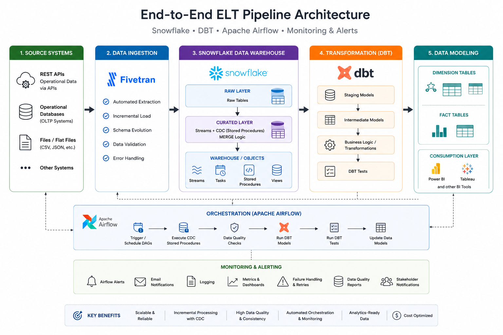

# Snowflake-DBT-Airflow-ELT-Pipeline

Modern data engineering project demonstrating ELT orchestration, CDC implementation, data transformation, and dimensional modeling using Snowflake, Airflow, and DBT.

## Project Overview

This project demonstrates a modern cloud-based ELT architecture that ingests data from multiple REST APIs into Snowflake, implements Change Data Capture (CDC), performs data transformations using DBT, and orchestrates workflows through Apache Airflow.

The solution follows industry-standard data engineering practices including incremental loading, data quality validation, automated transformations, and monitoring.

## Business Use Case

Organizations receive operational data from multiple external systems such as inventory, supplier, product, and transaction management platforms. This project centralizes the data into Snowflake and transforms it into analytics-ready datasets for reporting and business intelligence.

This solution addresses these challenges by implementing an automated ELT framework that:

Ingests data from source systems into Snowflake.
Captures incremental changes using CDC patterns.
Applies business transformations using DBT.
Performs automated data quality checks.
Delivers curated fact and dimension tables for downstream analytics.

## Technology Stack

- Data Warehouse: Snowflake
- Data Ingestion: Fivetran, REST APIs
- Orchestration: Apache Airflow
- Transformation: DBT, SQL
- CDC: Snowflake Streams, Stored Procedures, MERGE
- Data Modeling: Star Schema, Fact & Dimension Tables
- Monitoring: Airflow Alerts, Logging
- Reporting: Power BI, Tableau
- Version Control: Git, GitHub

<h2>Architecture Diagram</h2>

  

## ELT Workflow

This project implements a production-grade ELT architecture using Snowflake, Apache Airflow, DBT, and Fivetran to deliver scalable and analytics-ready datasets.

## Workflow
- Data Ingestion – Fivetran extracts data from REST APIs and loads it into Snowflake Raw tables.
- CDC Processing – Snowflake Streams and Stored Procedures capture incremental changes and apply them to Curated tables using MERGE operations.
- Orchestration – Apache Airflow manages workflow execution, dependencies, monitoring, retries, and notifications.
- Data Quality Validation – Automated checks validate data completeness, uniqueness, and business rules.
- Transformation – DBT transforms curated data into staging, intermediate, and mart models.
- Data Modeling – Fact and Dimension tables are built following dimensional modeling principles.
- Analytics & Reporting – Business users consume analytics-ready datasets through Power BI and Tableau.

## Flow
REST APIs -> Fivetran -> Snowflake Raw Layer -> CDC (Streams + Stored Procedures) -> Snowflake Curated Layer -> Apache Airflow -> DBT Transformations -> Fact & Dimension Tables -> Power BI / Tableau

## Key Features
Incremental Data Processing
Change Data Capture (CDC)
Apache Airflow Orchestration
DBT Transformations & Testing
Data Quality Validation
Dimensional Data Modeling
Monitoring & Alerting
Scalable ELT Architecture
